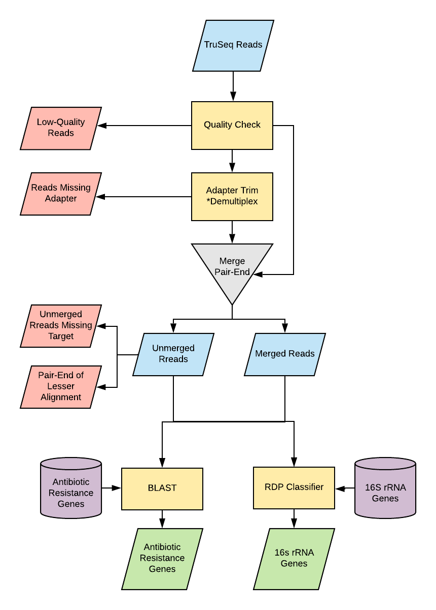

<br>
<br>

```{r setup, echo=FALSE}
knitr::opts_chunk$set(warning = FALSE, message = FALSE)
```

# Sequencing Results {.tabset .tabset-pills}
<br>

```{r, setup_sequencing, echo=FALSE, eval=FALSE}
 file_path = '../data/raw_reads'
 files <- dir(file_path, full.names = TRUE)
 files <- normalizePath(files)
 mock_files <- files[grep('Mock', files)]
 mock_qual <- schuylR::sequence_quality(mock_files)
 saveRDS(mock_qual, "../data/sequencing/mock_qual.RDS")

 sci_files <- files[grep('SCI-', files)]
 sci_qual <- schuylR::sequence_quality(sci_files)
 saveRDS(sci_qual, "../data/sequencing/sci_qual.RDS")

 scii_files <- files[grep('SCII-', files)]
 scii_qual <- schuylR::sequence_quality(scii_files)
 saveRDS(scii_qual, "../data/sequencing/scii_qual.RDS")

 fecal_files <- files[grep('X1P', files)]
 fecal_qual <- schuylR::sequence_quality(fecal_files)
 saveRDS(fecal_qual, "../data/sequencing/fecal_qual.RDS")
```

```{r setupsequencing, echo=FALSE}
sample_seq_results <- fread('../data/samples/sample_seq_results.csv')
```

## Mock-Community {.tabset .tabset-pills}
```{r mocksequencing, echo=FALSE}
mock_qual <- readRDS('../data/sequencing/mock_qual.RDS')
graph_data <- mock_qual[[1]]
stat_data <- mock_qual[[2]]
annotations <- mock_qual[[3]]
```

### MiSeq Quality scores {.tabset .tabset-pills}
```{r, mock_qual, results='asis', echo=FALSE, fig.width=12, fig.height=5, cache=TRUE}
n=1
for (i in grep("_R1_", annotations$file)){
  cat("####", n, '<br>', '\n\n')
  print(schuylR::plot_sequence_quality(list(
  	graph_data[file %in% annotations$file[c(i,i+1)]],
  	stat_data[file %in% annotations$file[c(i,i+1)]],
  	annotations[file %in% annotations$file[c(i,i+1)]])))
  cat('\n', '<br><br><br>', '\n\n')
  n=n+1
}
```
<br>
<br>

### Sequence Results
```{r mock_ressequencing, echo=FALSE}
datatable(sample_seq_results[Sample %in% sample_seq_results$Sample[grep('Mock', sample_seq_results$Sample)]])
```
<br>
<br>


## Soil Column I {.tabset .tabset-pills}
```{r scisequencing, echo=FALSE}
sci_qual <- readRDS('../data/sequencing/sci_qual.RDS')
graph_data <- sci_qual[[1]]
stat_data <- sci_qual[[2]]
annotations <- sci_qual[[3]]
```

### MiSeq Quality scores {.tabset .tabset-pills}
```{r, sci_qual, results='asis', echo=FALSE, fig.width=12, fig.height=5, cache=TRUE}
n=1
for (i in grep("_R1_", annotations$file)){
  cat("####", n, '<br>', '\n\n')
  print(schuylR::plot_sequence_quality(list(
  	graph_data[file %in% annotations$file[c(i,i+1)]],
  	stat_data[file %in% annotations$file[c(i,i+1)]],
  	annotations[file %in% annotations$file[c(i,i+1)]])))
  cat('\n', '<br><br><br>', '\n\n')
  n=n+1
}
```
<br>
<br>

### Sequence Results
```{r sci_ressequencing, echo=FALSE}
datatable(sample_seq_results[Sample %in% sample_seq_results$Sample[grep('SCI_', sample_seq_results$Sample)]])
```
<br>
<br>


## Soil Column II {.tabset .tabset-pills}
```{r sciisequencing, echo=FALSE}
scii_qual <- readRDS('../data/sequencing/scii_qual.RDS')
graph_data <- scii_qual[[1]]
stat_data <- scii_qual[[2]]
annotations <- scii_qual[[3]]
```

### MiSeq Quality scores {.tabset .tabset-pills}
```{r, scii_qual, results='asis', echo=FALSE, fig.width=12, fig.height=5, cache=TRUE}
n=1
for (i in grep("_R1_", annotations$file)){
  cat("####", n, '<br>', '\n\n')
  print(schuylR::plot_sequence_quality(list(
  	graph_data[file %in% annotations$file[c(i,i+1)]],
  	stat_data[file %in% annotations$file[c(i,i+1)]],
  	annotations[file %in% annotations$file[c(i,i+1)]])))
  cat('\n', '<br><br><br>', '\n\n')
  n=n+1
}
```
<br>
<br>

### Sequence Results
```{r scii_ressequencing, echo=FALSE}
datatable(sample_seq_results[Sample %in% sample_seq_results$Sample[grep('SCII_', sample_seq_results$Sample)]])
```
<br>
<br>


## Swine Fecal {.tabset .tabset-pills}
```{r fecalsequencing, echo=FALSE}
fecal_qual <- readRDS('../data/sequencing/fecal_qual.RDS')
graph_data <- fecal_qual[[1]]
stat_data <- fecal_qual[[2]]
annotations <- fecal_qual[[3]]
```

### MiSeq Quality scores {.tabset .tabset-pills}
```{r, fecal_qual, results='asis', echo=FALSE, fig.width=12, fig.height=5, cache=TRUE}
n=1
for (i in grep("_R1_", annotations$file)){
  cat("####", n, '<br>', '\n\n')
  print(schuylR::plot_sequence_quality(list(
  	graph_data[file %in% annotations$file[c(i,i+1)]],
  	stat_data[file %in% annotations$file[c(i,i+1)]],
  	annotations[file %in% annotations$file[c(i,i+1)]])))
  cat('\n', '<br><br>', '\n\n')
  n=n+1
}
```
<br>
<br>
<br>

### Sequence Results
```{r fecal_ressequencing, echo=FALSE}
datatable(sample_seq_results[Sample %in% sample_seq_results$Sample[grep('X1P', sample_seq_results$Sample)]])
```
<br>
<br>
<br>

# Read Processing Pipeline {.tabset .tabset-pills}
<br>

## Workflow 

{width=50%}

<br>
<br>
<br>

## Software

[Cutadapt](https://cutadapt.readthedocs.io/en/stable/) - demultiplexing and primer-trimming
<br>
[Cutadapt removes adapter sequences from high-throughput sequencing reads](http://journal.embnet.org/index.php/embnetjournal/article/view/200)
<br>

[PEAR](https://cme.h-its.org/exelixis/web/software/pear/doc.html) - paired-end read assembler
<br>
[PEAR: a fast and accurate Illumina Paired-End reAd mergeR](https://academic.oup.com/bioinformatics/article/30/5/614/247231?login=true)
<br>

[BLAST](https://blast.ncbi.nlm.nih.gov/Blast.cgi?PAGE_TYPE=BlastDocs&DOC_TYPE=Download) - basic local alignment search tool
<br>
[Basic local alignment search tool](https://www.sciencedirect.com/science/article/pii/S0022283605803602)

[RDP-Classifier](http://rdp.cme.msu.edu/classifier/classifier.jsp;jsessionid=F982AA43F66459C6DCA8704AEF608786.10.0.0.9) - 16S classifier
<br>
[Naïve Bayesian Classifier for Rapid Assignment of rRNA Sequences into the New Bacterial Taxonomy](https://aem.asm.org/content/73/16/5261.short)

<br>
<br>

# {-}

## Primer Trimming and Demultiplexing

```{r cutadapt, engine = 'bash', eval = FALSE}
wd="../data/read_processing"
raw_files="${wd}/raw"

for raw_file in $(ls ${raw_files}/putvariablehere*_R1_*)
do \
sample="$(basename -- $raw_file)"
sample=$(echo "$sample" | cut -f 1 -d '.')
sample=$(echo "$sample" | cut -f 1 -d '_')

mkdir -p ${wd}/split/${sample}

cutadapt \
	--pair-filter=both \
	-e 0.10 \
	-q 15 \
	-g file:${wd}/../data/DARTE_forward_primers \
	-G file:${wd}/../data/DARTE_reverse_primers \
	-o ${wd}/split/${sample}/{name}.R1.1.fastq \
	-p ${wd}/split/${sample}/{name}.R2.1.fastq \
	$(ls ${wd}/raw/${sample}*_R2_*) \
	$(ls ${wd}/raw/${sample}*_R1_*)
cutadapt \
	--pair-filter=both \
	-e 0.10 \
	-q 15 \
	-g file:${wd}/../data/DARTE_forward_primers \
	-G file:${wd}/../data/DARTE_reverse_primers \
	-o ${wd}/split/${sample}/{name}.R1.2.fastq \
	-p ${wd}/split/${sample}/{name}.R2.2.fastq \
	${wd}/split/${sample}/unknown.R2.1.fastq \
	${wd}/split/${sample}/unknown.R1.1.fastq
done
```

## Pair-end Read Merging

```{r pear, engine = 'bash', eval = FALSE}
for primer in $(grep ">" ${wd}/../data/DARTE_forward_primers  | cut -c2-)
do \
mkdir -p ${wd}/merge/${sample}
mkdir -p ${wd}/combined/${sample}

cat ${wd}/split/${sample}/${primer}*R1* > ${wd}/split/${sample}/${primer}.R1.fastq
cat ${wd}/split/${sample}/${primer}*R2* > ${wd}/split/${sample}/${primer}.R2.fastq

for file in $(ls ${wd}/split/${sample}/*.R1.fastq)
do \
file_name="$(basename -- $file)"
file_name=${file_name%.fastq}
file_name=$(echo $file_name| tr : _)
file_name=$(echo "$file_name" | cut -f 1 -d '.')

pear/bin/pear \
-j 8 \
-p 0.05 \
-v 10 \
-m 350 \
-f ${file} \
-r ${wd}/split/${sample}/${file_name}.R2.fastq \
-o ${wd}/merge/${sample}/${file_name}_merged

cat ${wd}/merge/${sample}/${file_name}_merged.assembled.fastq \
	${wd}/merge/${sample}/${file_name}_merged.unassembled.forward.fastq \
	${wd}/merge/${sample}/${file_name}_merged.unassembled.reverse.fastq \
	> ${wd}/combined/${sample}/${file_name}_combined.fastq;

sed -n '1~4s/^@/>/p;2~4p' ${wd}/combined/${sample}/${file_name}_combined.fastq \
	> ${wd}/combined/${sample}/${file_name}.fasta
done
done
```
## BLAST

```{r blast, engine = 'bash', eval = FALSE}
makeblastdb -in ../data/ARG_database.fa -dbtype nucl -out ../data/DARTE-QM_ARGs

for primer in $(grep ">" ${wd}/../data/DARTE_forward_primers  | cut -c2-)
do
cat ${wd}/split/${sample}/${primer}*R1* > ${wd}/split/${sample}/${primer}.R1.fastq
cat ${wd}/split/${sample}/${primer}*R2* > ${wd}/split/${sample}/${primer}.R2.fastq

for file in $(ls ${wd}/split/${sample}/*.R1.fastq)
do \
file_name="$(basename -- $file)"
file_name=${file_name%.fastq}
file_name=$(echo $file_name| tr : _)
file_name=$(echo "$file_name" | cut -f 1 -d '.')

/mnt/home/smithsch/software/ncbi-blast-2.9.0+/bin/blastn \
	-db ../data/DARTE-QM_ARGs \
	-query ${wd}/combined/${sample}/${file_name}.fasta \
	-out ${wd}/blast/${sample}/${file_name}.blast \
	-perc_identity 90 \
	-outfmt 6 \
	-num_threads 8;

done
done
```

